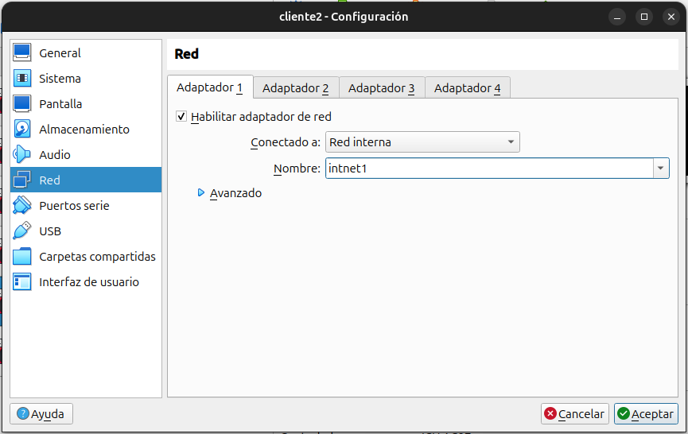
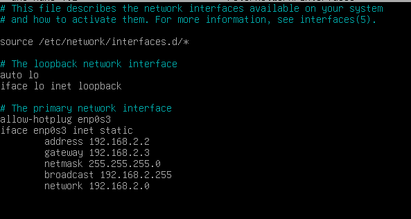
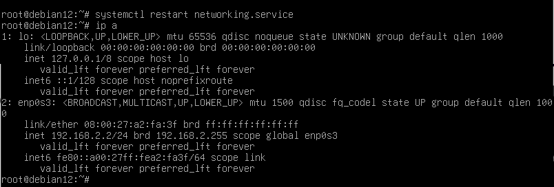
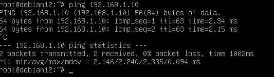
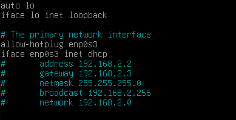
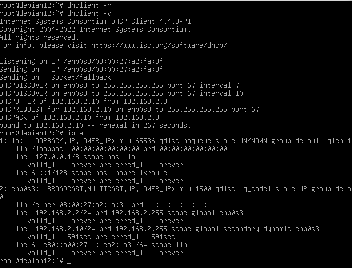
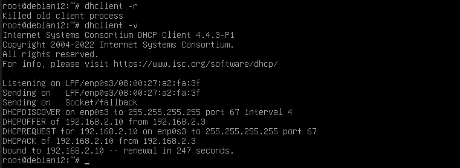

# Cliente
Ahora que ya está el DHCP configurado correctamente, nos vamos a nuestro
equipo cliente y antes de arrancarlo debemos de ponerlo en Red Interna
(intnet1).

Una vez arrancado configuramos la interfaz en
estática para comprobar que hay conectividad con el servidor. **(GATEWAY DE RELAY)**:

`nano /etc/network/interfaces`

Reiniciamos servicio networking y comprobamos:

`systemctl restart networking,service`

Hacemos ping al servidor **Ip_Server=192.168.1.10** para comprobar la conectividad.

Una vez haya conectividad con el cliente vamos al servidor a configurar `/etc/default/isc-dhcp-server `,
para configurar la tarjeta que va a escuchar las peticiones del cliente.

Una vez activo el sever dhcp  nos vamos al cliente y cambiamos la red en modo dhcp . 
`/etc/network/interfaces`

Una vez hecho , hacemos `dhclient -r` y `dhclient -v `para solicitar ip al servidor

Como vemos nos la ha concedido.

Si abrimos en el Servidor
`tail -f /var/lib/dhcp/dhcp.leases`
podemos verl el proceso de como concede la ip.

Abrimos el failover y ponemos `tail -f /vat/lib/dhcp/dhcp.leases `y paramos el servicio
dhcp en servidor
Una vez hecho, en el cliente ponemos `dhclient -r `y `dhclient -v `para pedir ip al failover ip
(ya que el servidor está parado)

