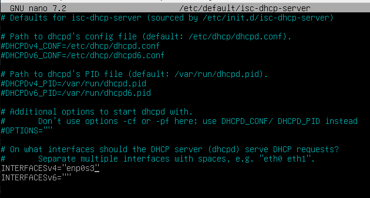

# Failover

Para poder instalar el servidor DHCP en Debian debemos de instalarnos el
paquete llamado:
`apt install isc-dhcp-server`
Pero antes **actalizaremos** el sistema y los paquetes.
` sudo apt update`
`sudo apt upgrade`

Una vez instalado apagamos y ponemos **red interna** en VirtualBox, la misma que el
**servidor**.

`poweoff`

Configuramos el archivo `/etc/default/isc-dhcp-server` para que el dhcp failover escuche
las peticiones por esa tarjeta, que es la suya.

Nos vamos a configurar el archivo de configuración del dhcp Failover ( ponemos subnets)

`nano /etc/dhcp/dhcp.conf`

y hacemos restart del servicio dhcp 

`systemctl restart isc-dhcp-server `

Volvemos al **servidor** a editar el `nano /etc/dhcp/dhcpd.conf `

En relay ponemos la ip del fairlover en `/etc/default/isc-dhcp-relay`

Abrimos el failover y ponemos `tail -f /vat/lib/dhcp/dhcp.leases `y **paramos** el servicio
dhcp en **servidor**

