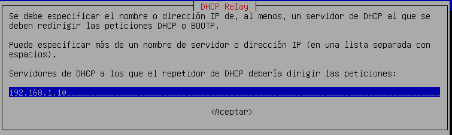
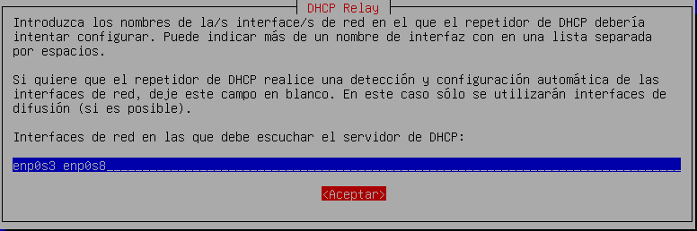
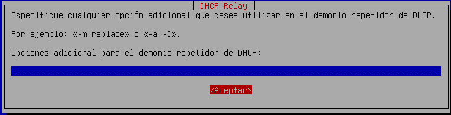
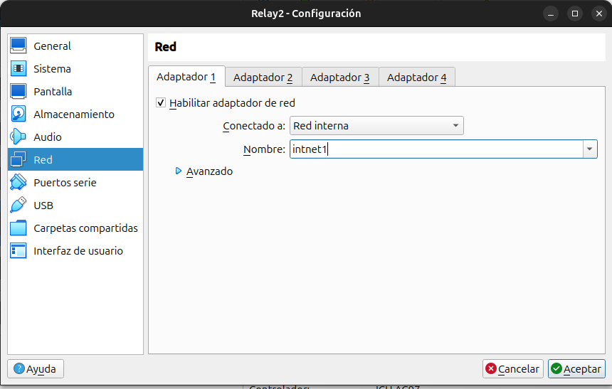
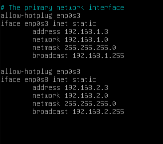
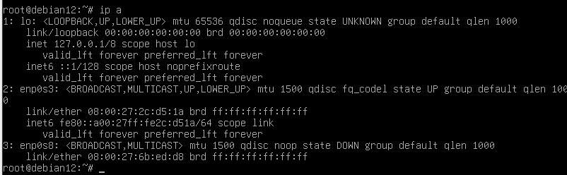
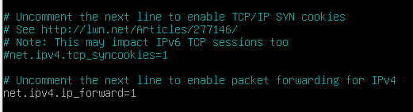
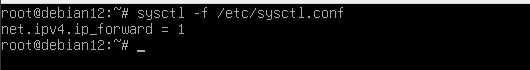
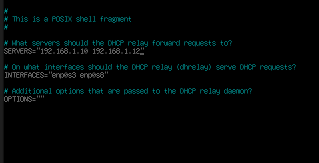

# Relay 
Para poder instalar el paquete DHCP en Relay  debemos de instalarnos el
paquete llamado:
`apt install isc-dhcp-relay`
Pero antes **actalizaremos** el sistema y los paquetes.
` sudo apt update`
`sudo apt upgrade`

Al instalarlo **automaticamente** se nos abrirá esta pantalla, donde tendremos que poner la **IP DEL SERVER**, que en mi caso es la 192.168.1.10 :

A continuacion nos pedira las interfaces de red por donde escuchara el servidor dhcp,que en mi caso son **enp0s3** y **enp0s8**:

En especificaciones adicionales no pondremos nada.

Una vez instalado apagamos la máquina y configuramos dos tarjetas de red:
  1. Para la red de cliente 
  *El nombre de la red interna tiene que coincidir la del cliente.*

  
  
  2. Para la red del servidor
     
  

Arrancamos la maquina y configuramos las direcciones de ambas tarjetas de red
`nano /etv/network/interfaces`

---
**enp0s3 → Red de servidor
enp0s8 → Red de cliente**

---

Cuando lo hagamos, reiniciamos el servicio networking
`systemctl restart networking`

Comprobamos que se han cambiado las ips corectamente 

Vamos a: 
 `nano /etc/sysctl.conf `

para habilitar el fowarding, descomentamos la linea de ipv4forward. (reenvio de paquetes)

 

Una vez hecho  comprobampos los cambios con el comando `sysctl -f /etc/sysctl.conf`

En relay ponemos la ip del fairlover en `/etc/default/isc-dhcp-relay`

y reiniciamos isc-dhcp-relay
`systemctl restart isc-dhcp-relay.service`
