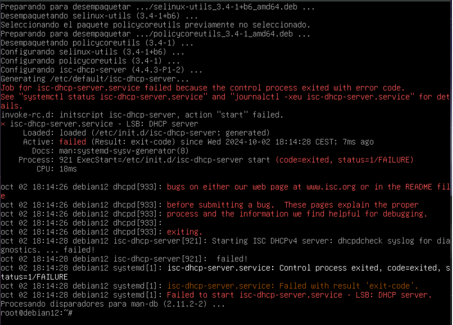
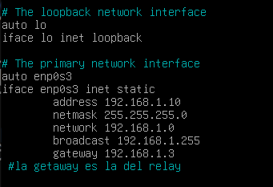
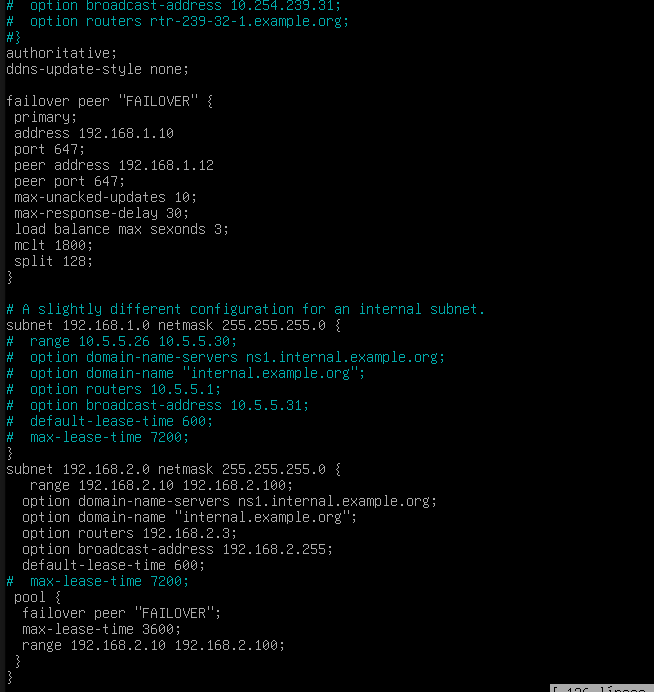
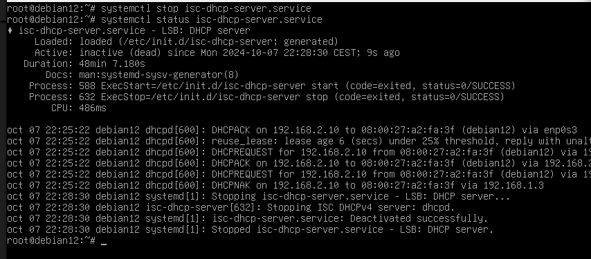

# Server
Para poder instalar el servidor DHCP en Debian debemos de instalarnos el
paquete llamado:
`apt install isc-dhcp-server`
Pero antes **actalizaremos** el sistema y los paquetes.
` sudo apt update`
`sudo apt upgrade`

Cuando lo instalemos nos va a salir un **error**, debido a que se va a lanzar
automáticamente el DHCP pero no podra hacer nada porque todavia no tenemos
ningúna configuración establecida.

Ahora debemos de parar la máquina y cambiar los adaptadores de red a **RED
INTERNA**.

Arrancamos de nuevo la MV y nos iremos al archivo de configuración
`nano /etc/network/interfaces` y tenemos que ponerle una **IP ESTÁTICA** a nuestro
**DHCP**.

Comprobamos que la ip se ha cambiado  correctamente

Una vez haya conectividad con el cliente vamos al servidor a configurar `/etc/default/isc-dhcp-server `,
para configurar la tarjeta que va a escuchar las peticiones del cliente.

Reiniciamos el servicio dhcp
`systemctl restart isc-dhcp-server.service`

Da error porque no esta configurado el dhcp-server.

Ahora configuramos el servicio dhcp en servidor (linea 49)
**option-routers (gateway del relay)**
buscar por linea `Ctrl + -`

`nano /etc/dhcp/dhcp.conf`

Guardamos y reiniciamos el servicio , status para comprobar que esta todo bien

`systemctl restart isc-dhcp-server.service`

`systemctl status isc-dhcp-server.service`

Una vez activo nos vamos al cliente y la red en modo dhcp . 
`/etc/network/interfaces`

Estando ya configu7rado el dhcp de cliente.

Si abrimos en el Servidor
`tail -f /var/lib/dhcp/dhcp.leases`
podemos verl el proceso de como concede la ip.

Una vez nos de ip vamos a configurar el **FAILOVER** por si falla el Servidor principal.

Despues de haber configurado el servidor dhcp en **Failover**

Volvemos al **servidor** a editar el `nano /etc/dhcp/dhcpd.conf `

y reiniciamos servicio dhcp 

`systemctl restart isc-dhcp-server.service`

Abrimos el failover y ponemos tail -f /vat/lib/dhcp/dhcp.leases y paramos el servicio

